# Subscription Management / Revenue Operations Platform

Architecture and database design gate. This document summarizes the 4,419-line master prompt shared on 2026-09-14 and records a critical review. It is a design artifact, not authorization to implement the schema or application. The master prompt remains the authoritative source if this summary omits nuance.

## 1. Product scope and fixed decisions

The platform serves multiple organizations managing the sequence **catalog → plans/pricing → customers → quotations → subscriptions → recurring billing → invoices → payments → reporting**. The original problem statement requires authentication, dashboard, products and variants, recurring plans, customers/contacts, subscription lifecycle, quotation templates, invoices, payments, discounts, taxes, users, and reports. Original roles are Admin, Internal User, and Portal/User; only Admin may create Internal Users. The initial subscription flow is Draft → Quotation → Confirmed → Active → Closed, and invoice flow is Draft → Confirmed → Paid. Additional states are allowed only with explicit business meaning.

The architecture is a **modular monolith**: React/TypeScript/Vite/Tailwind/shadcn/ui/TanStack Query web app; NestJS/TypeScript/REST/Zod API; Prisma with shared Neon PostgreSQL via `DATABASE_URL`. Development tooling is pnpm, Turborepo, Git, and GitHub. NestJS domain services own calculations, transitions, and other business invariants. The browser may preview amounts but cannot authoritatively calculate or submit invoice totals, tax, discounts, settlement, or status transitions.

Initial authentication is email/password with secure password hashing, expiring JWTs, and tenant-aware RBAC. OAuth, SSO/SAML, email verification, and password reset are deferred. Never expose password hashes, log secrets, or commit credentials. Apply input validation, safe errors, and appropriate CORS.

Phase 1 does **not** include AI, Neo4j, RAG, pgvector, Python/FastAPI, LangGraph, Redis/BullMQ, Kafka, Kubernetes, payment gateway integrations, CI/CD, cloud deployment, or advanced observability. Future AI may combine SQL, a graph projection, policy-document retrieval, and analytics, but PostgreSQL remains the transactional source of truth.

The proposed repository is `apps/api`, `apps/web`, `packages/database`, `packages/config`, selectively `packages/types` and later `packages/ui`, plus `docs/architecture`, `docs/decisions`, workspace and Turbo config, and `.env.example`. Backend modules should follow domains rather than tables; services may use Prisma directly when an extra repository abstraction adds no value. Frontend server state belongs in TanStack Query.

## 2. Domain map and important relationships

| Domain               | Responsibility                                            | Key relationships                                                                     |
| -------------------- | --------------------------------------------------------- | ------------------------------------------------------------------------------------- |
| Identity and tenancy | Global login identity, organizations, active membership   | User M:N Organization via OrganizationMembership                                      |
| RBAC                 | Organization-specific roles and granular permissions      | Membership M:N Role; Role M:N Permission                                              |
| Customers            | Buyer records, contacts, addresses                        | Organization 1:N Customer; Customer 1:N Contact/Address                               |
| Catalog              | Product, variants, attributes and values                  | Product 1:N Variant/Attribute; Variant M:N AttributeValue                             |
| Plans and pricing    | Subscription offer, included products, effective prices   | Plan 1:N PlanItem/PlanPrice; PlanItem → Product and optional Variant                  |
| Subscriptions        | Lifecycle, purchased items, amendments, business events   | Customer/Plan 1:N Subscription; Subscription 1:N child history                        |
| Quotations           | Reusable templates and, if needed, issued customer quotes | Template 1:N TemplateItem; Quote 1:N QuoteItem                                        |
| Billing              | Invoice generation, immutable finalized line snapshots    | Customer/Subscription 1:N Invoice; Invoice 1:N InvoiceItem                            |
| Payments             | Partial settlement, attempts, refunds, corrections        | Invoice 1:N Payment initially; Payment 1:N Transaction/Refund; Invoice 1:N CreditNote |
| Pricing rules        | Discounts and effective tax configuration                 | Tenant-owned rules; applied amounts snapshotted on invoices                           |
| Audit and reports    | Actor-level changes and operational queries               | AuditLog distinct from SubscriptionEvent; reports query PostgreSQL                    |

Users are **global identities**; `users` has no `organization_id`. A request chooses an active organization, proves current membership, resolves roles/permissions in that organization, then executes tenant-scoped queries. Major tenant-owned rows carry `organization_id` where useful for authorization, uniqueness, and indexes. Child tables may inherit ownership via a parent only when cross-tenant links are safely prevented. The frontend's submitted organization ID never grants access. Admin-only creation of Internal Users is enforced through a permission and domain policy within the active organization.

## 3. Proposed ERD

This is a target relationship map, **not** a commitment to create every table in the first migration. Optional/later entities are marked in the inventory below. Mermaid uses simplified names and omits low-value fields.

```mermaid
erDiagram
  USER ||--o{ ORGANIZATION_MEMBERSHIP : joins
  ORGANIZATION ||--o{ ORGANIZATION_MEMBERSHIP : has
  ORGANIZATION_MEMBERSHIP ||--o{ MEMBERSHIP_ROLE : receives
  ROLE ||--o{ MEMBERSHIP_ROLE : assigned
  ROLE ||--o{ ROLE_PERMISSION : grants
  PERMISSION ||--o{ ROLE_PERMISSION : included
  ORGANIZATION ||--o{ ROLE : owns
  ORGANIZATION ||--o{ CUSTOMER : owns
  CUSTOMER ||--o{ CUSTOMER_CONTACT : has
  CUSTOMER ||--o{ CUSTOMER_ADDRESS : has
  ORGANIZATION ||--o{ PRODUCT : owns
  PRODUCT ||--o{ PRODUCT_VARIANT : has
  PRODUCT ||--o{ PRODUCT_ATTRIBUTE : defines
  PRODUCT_ATTRIBUTE ||--o{ PRODUCT_ATTRIBUTE_VALUE : allows
  PRODUCT_VARIANT ||--o{ VARIANT_ATTRIBUTE_VALUE : selects
  PRODUCT_ATTRIBUTE_VALUE ||--o{ VARIANT_ATTRIBUTE_VALUE : selected
  ORGANIZATION ||--o{ PLAN : owns
  PLAN ||--o{ PLAN_ITEM : includes
  PRODUCT ||--o{ PLAN_ITEM : included
  PRODUCT_VARIANT o|--o{ PLAN_ITEM : optionally_included
  PLAN ||--o{ PLAN_PRICE : priced_by
  CUSTOMER ||--o{ SUBSCRIPTION : buys
  PLAN ||--o{ SUBSCRIPTION : offered_as
  SUBSCRIPTION ||--o{ SUBSCRIPTION_ITEM : contains
  SUBSCRIPTION ||--o{ SUBSCRIPTION_AMENDMENT : amended_by
  SUBSCRIPTION ||--o{ SUBSCRIPTION_EVENT : records
  CUSTOMER ||--o{ INVOICE : billed
  SUBSCRIPTION o|--o{ INVOICE : generates
  INVOICE ||--o{ INVOICE_ITEM : contains
  INVOICE ||--o{ PAYMENT : settled_by
  PAYMENT ||--o{ PAYMENT_TRANSACTION : attempted_through
  PAYMENT ||--o{ REFUND : refunded_by
  INVOICE ||--o{ CREDIT_NOTE : corrected_by
  CREDIT_NOTE ||--o{ CREDIT_NOTE_ITEM : contains
  ORGANIZATION ||--o{ QUOTATION_TEMPLATE : owns
  QUOTATION_TEMPLATE ||--o{ QUOTATION_TEMPLATE_ITEM : contains
  ORGANIZATION ||--o{ QUOTATION : owns
  CUSTOMER ||--o{ QUOTATION : receives
  QUOTATION ||--o{ QUOTATION_ITEM : contains
  ORGANIZATION ||--o{ DISCOUNT : owns
  DISCOUNT ||--o{ DISCOUNT_RULE : qualifies
  ORGANIZATION ||--o{ TAX : owns
  TAX ||--o{ TAX_RULE : applies
  ORGANIZATION ||--o{ AUDIT_LOG : records
```

## 4. Table inventory

`T` means tenant-owned, `G` global, and `P` owned through a parent. `H` identifies historical/transactional records; `M` means mutable master/configuration. Phase numbers follow the master prompt, with **later** for optional tables whose need must be established. A table's presence here is not a mandate to implement it.

| Table(s)                                                                             | Domain / purpose                                      | Scope | Nature | Phase                               |
| ------------------------------------------------------------------------------------ | ----------------------------------------------------- | ----- | ------ | ----------------------------------- |
| `organizations`                                                                      | Tenant identity, currency, timezone, status           | G     | M      | 3                                   |
| `users`                                                                              | Global email/password identities                      | G     | M      | 3                                   |
| `organization_memberships`                                                           | User–tenant membership and status                     | T     | H      | 3                                   |
| `roles`                                                                              | Tenant-specific/system role definitions               | T     | M      | 5                                   |
| `permissions`                                                                        | Global granular permission catalog                    | G     | M      | 5                                   |
| `membership_roles`, `role_permissions`                                               | Explicit RBAC joins                                   | P     | M/H    | 5                                   |
| `customers`                                                                          | Buying businesses/people, tenant customer number      | T     | M      | 6                                   |
| `customer_contacts`, `customer_addresses`                                            | Contacts and typed addresses                          | P     | M      | 6                                   |
| `products`                                                                           | Sellable catalog items and internal cost              | T     | M      | 7                                   |
| `product_variants`                                                                   | SKUs and variant identity                             | P     | M      | 7                                   |
| `product_attributes`, `product_attribute_values`, `product_variant_attribute_values` | Attribute options and variant selections              | P     | M      | 7                                   |
| `plans`                                                                              | Subscription offering and lifecycle options           | T     | M      | 8                                   |
| `plan_items`                                                                         | Product/variant composition and quantity              | P     | M      | 8                                   |
| `plan_prices`                                                                        | Currency/period/effective-date price history          | P     | H      | 8                                   |
| `subscriptions`                                                                      | Customer contract/lifecycle and periods               | T     | H      | 9                                   |
| `subscription_items`                                                                 | Purchased item and commercial snapshots               | P     | H      | 9                                   |
| `subscription_amendments`, `subscription_events`                                     | Changes and business timeline                         | P/T   | H      | 9                                   |
| `quotation_templates`, `quotation_template_items`                                    | Reusable quotation configurations                     | T/P   | M      | 10                                  |
| `quotations`, `quotation_items`                                                      | Issued customer offer and line snapshots, if needed   | T/P   | H      | 10/later                            |
| `invoices`, `invoice_items`                                                          | Finalizable financial documents and line snapshots    | T/P   | H      | 11                                  |
| `payments`                                                                           | Invoice settlement, initially one invoice per payment | T     | H      | 12                                  |
| `payment_transactions`                                                               | Gateway attempts/callback references if integrated    | P     | H      | later                               |
| `refunds`                                                                            | Independent refund history                            | T     | H      | 12/later                            |
| `credit_notes`, `credit_note_items`                                                  | Corrections to finalized invoices                     | T/P   | H      | later                               |
| `discounts`, `discount_rules`, applicability joins                                   | Eligibility and fixed/percentage discounts            | T/P   | M      | 13                                  |
| `taxes`, `tax_rules`                                                                 | Effective tax configuration                           | T/P   | M      | 13                                  |
| `audit_logs`                                                                         | Append-only actor/action/resource history             | T     | H      | Introduce alongside audited actions |
| `organization_sequences`                                                             | Atomic tenant-scoped business numbering               | T     | H      | With first numbered entity          |

No separate reporting table is initially required; reports query operational PostgreSQL data. There is no payment allocation table unless a single payment must cover multiple invoices.

## 5. Data design and financial integrity

Use UUID primary keys and separate tenant-scoped business numbers such as `CUS-000001`, `SUB-000001`, `INV-000001`, `PAY-000001`, `QUO-000001`, and `REF-000001`. Generate numbers atomically with a tenant-aware sequence/counter when needed; `COUNT(*) + 1` races. Use `TIMESTAMPTZ` for instants and `DATE` for pure calendar dates. Model database names consistently in `snake_case`, with Prisma mappings if models use PascalCase. Add `created_at` and `updated_at` where appropriate.

Store money in PostgreSQL `NUMERIC(19,4)` initially and calculate with a decimal library/Prisma Decimal, never authoritative JS `Number` or floating-point fields. Every commercial amount carries a currency code (ISO 4217 style); an organization's default currency does not override a transaction's currency. Currency-specific minor units, display precision, calculation precision, tax/discount rounding, and line-versus-invoice rounding must be centralized before billing. Do not assume all currencies have two minor digits.

`Plan` is an offering; `PlanPrice` is a separate amount by currency, period (daily/weekly/monthly/yearly), and effective interval. Never overwrite a used price. Prevent conflicting active intervals for the same plan/currency/period. A subscription item snapshots purchased description, quantity, unit price, currency, discounts and applicable tax/commercial terms as needed. Invoice items snapshot description, quantity, unit price, discount, tax, and totals; finalized invoice totals remain historical financial records. Current product, discount, tax, or plan settings cannot change historical documents.

Invoice draft is editable. At finalization, pricing lines and totals become effectively immutable; use void/replacement or credit notes for corrections. Treat overdue as a likely derived condition (`due_date < today` and outstanding balance > 0), not automatically a persistent state. Partial payment requires multiple payment records or allocations; initial model is invoice 1:N payments. A refund is a new record linked to a payment and does not reduce the original payment amount. Gateway transactions are distinct from a payment and deferred until integration. Preserve financial records; no destructive cascading from customers or subscriptions into invoices/payments.

`SubscriptionAmendment` records commercial changes (upgrade, downgrade, quantity/plan/renewal changes, pause/resume); `SubscriptionEvent` records business events (created, confirmed, activated, paused, renewed, cancelled, expired). `AuditLog` separately answers who changed what, when, under which organization and resource; it is generally append-only. An amendment may need effective dating and explicit before/after commercial values; do not hide essential queryable facts in arbitrary JSON.

Subscription state changes use explicit operations (`confirm`, `activate`, `pause`, `resume`, `cancel`, etc.) with allowed transition checks. Invoice finalization/voiding likewise uses commands rather than unrestricted status PATCH. Multi-row operations such as activation, finalization, payment, renewal, and refund must use database transactions when consistency requires it. Use unique provider transaction references/idempotency keys for retried external callbacks once integrations exist. Consider optimistic version fields only for entities with demonstrated concurrent-edit risk.

## 6. Initial index and deletion plan

Start with unique indexes on global user email and organization slug; `(organization_id,user_id)` membership; tenant business numbers/codes for customer, product, plan, invoice and other numbered entities when introduced; role code per organization; permission code globally; composite keys for RBAC joins. Add tenant-led access indexes such as `(organization_id,status)` or `(organization_id,created_at)` on growing lists, and indexes for frequently joined `customer_id`, `subscription_id`, `invoice_id`, and `plan_id` based on actual queries. PostgreSQL does not index all foreign keys automatically. Avoid indexing every field, but use pagination on growing endpoints and avoid N+1 query patterns.

| Records                                                              | Deletion policy                                                                |
| -------------------------------------------------------------------- | ------------------------------------------------------------------------------ |
| Unused configuration children or draft-only data                     | Hard delete may be allowed with explicit ownership rules                       |
| Organizations, users, memberships, customers, products, plans, roles | Suspend/archive/deactivate preferred; restrict deletion when referenced        |
| Used plan prices, subscription items/amendments/events               | Preserve history; amendments/events append-only; restrict destructive deletion |
| Finalized invoices/items, payments, refunds, credit notes            | Restrict deletion; financial corrections via new records                       |
| Audit logs                                                           | Append-only with controlled retention policy if eventually needed              |

## 7. PostgreSQL versus NestJS responsibility

| Invariant                                                                                                             | Owner                                                                                                  |
| --------------------------------------------------------------------------------------------------------------------- | ------------------------------------------------------------------------------------------------------ |
| Primary/foreign keys, NOT NULL, uniqueness, numeric precision, simple positive-quantity/nonnegative-amount checks     | PostgreSQL                                                                                             |
| Membership authorization, permission resolution, allowed lifecycle transitions, pricing/tax/discount policy, rounding | NestJS domain services                                                                                 |
| Cross-tenant association safety                                                                                       | Both: tenant-scoped service queries and composite tenant-aware references/constraints where feasible   |
| Effective-price non-overlap                                                                                           | Both: service checks plus PostgreSQL exclusion constraint or locking/transaction strategy if practical |
| Invoice finalization, number generation, payment/refund consistency, idempotency                                      | Both: service orchestration within transactions plus unique/locking constraints                        |
| Historical snapshot completeness and finalized immutability                                                           | Both: service policy plus restricted update paths/appropriate database constraints where justified     |

For every model, review purpose, ownership, fields, PK/FKs, cardinality, uniqueness, indexes, nullability, delete behavior, history, tenant isolation, invariants, source-of-truth status, and whether enforcement belongs in PostgreSQL, NestJS, or both. Prisma convenience must not dictate weaker relational design; use reviewed SQL migrations for PostgreSQL features Prisma cannot express cleanly.

## 8. Critical review and decisions to resolve

1. **Quotation versus subscription state.** `QUOTATION` in the original subscription lifecycle overlaps with actual `Quotation`. Treat issued quotes as their own documents; decide whether a subscription can exist before quote acceptance and what `QUOTATION` state means. Avoid two competing sources of truth for the same sales stage.
2. **Price applicability.** `PlanPrice` by plan/currency/period is clear, but `SubscriptionItem.unit_price` may represent a package total or per-product prices. Define whether plan prices cover the bundle, item-level charges, or both before pricing schema. Also decide how renewals react to new public prices versus grandfathered contract prices.
3. **Tenant-safe foreign keys.** Direct `organization_id` on parents alone does not prevent a subscription in A from referencing a customer in B. Where feasible use composite `(organization_id,id)` references and matching unique keys, or enforce association checks transactionally. Apply this to plan items/variants, subscriptions, invoices, payments, RBAC joins, and reports.
4. **Role scope.** `roles.organization_id` is tenant-specific, while `is_system` hints at global built-in roles. Choose whether system roles are replicated per organization or truly global; do not leave an ambiguous nullable tenant key. Global permissions can remain a fixed catalog.
5. **Portal users.** A portal user may be a platform identity associated with a particular customer/contact. Membership alone does not establish which customer records they may see. Design an explicit customer-access link before implementing the portal role.
6. **Plan item tenant ownership.** A plan item can point to a product or variant from another organization unless checked. `variant_id` must belong to `product_id` as well. These are cross-row invariants requiring careful constraints/service validation.
7. **Payment balance and status.** `amount_paid`, `amount_due`, `PARTIALLY_PAID`, `PAID`, and refund status can conflict if all are mutable stored values. Store authoritative settled payments/refunds and finalized invoice totals; define a transactional projection or derived balance, with precise handling for pending/failed payments and credit notes.
8. **Tax and discount order.** The example totals imply a tax base after discount, but no universal policy is fixed. Specify application order, inclusive/exclusive tax, taxable jurisdictions, and rounding before invoice implementation. Tax and discount may need multiple applications per line; one `tax_amount` snapshot may not explain complex cases.
9. **Billing engine.** The proposed `Subscription` fields do not yet fully specify billing cadence, proration, billing run identity, and duplicate-period prevention. Introduce billing-period/charge records or a unique invoice generation key only when recurring invoice generation is implemented, and decide how `PlanPrice.billing_period` maps to `current_period_start/end`.
10. **Quotation templates versus actual quotes.** Templates are required by the original problem; actual quotation entities are conditional, but the stated quote-to-subscription workflow likely needs them. Confirm scope at Phase 10, with issued quote snapshots and validity.
11. **Invoice linkage.** `subscription_id` is nullable, which permits standalone invoices. Clarify whether Phase 11 supports them or simply retains nullable linkage for future flexibility.
12. **Date semantics.** Specify half-open effective intervals, organization timezone for billing dates, and UTC storage for instants. This prevents price overlap and ambiguous period boundaries.
13. **Authentication bootstrap.** If only Admins can create Internal Users, establish how the first organization and first Admin are created. Define a safe onboarding/seed flow before auth/RBAC.
14. **Scope discipline.** Payment transactions, refunds, credit notes, complex discount/tax rules, multiple customer addresses, and universal audit infrastructure should be built when the relevant workflow is real. Keep their future relationships possible without creating every theoretical table up front.

Recommended adjusted core model: global `User` and `Permission`; tenant `Organization`, `OrganizationMembership`, tenant `Role` with explicit joins; tenant customer/catalog/plan domains; effective `PlanPrice`; subscription with snapshotted items and append-only amendments/events; separate actual quote and template if the sales flow requires both; finalized invoice and line snapshots; invoice 1:N payment initially, with refunds and credit notes introduced alongside corresponding operations; audit logging for significant actions. Add tenant-aware composite references, explicit effective intervals, and transaction-safe numbering at the relevant phases. Keep reports as queries until performance justifies read models.

## 9. Implementation order and design gate

Repository foundation comes first: pnpm/Turborepo, React/Vite, NestJS, shared Neon branch/environment configuration, environment template, and health endpoint. Then Prisma migration infrastructure, followed by identity/tenancy, auth, RBAC, customers, catalog, plans/prices, subscriptions, quotations, invoices, payments/refunds, discounts/taxes, reporting, frontend completion, tests/hardening, and AI only later. Build business modules only after their design and dependencies are reviewed.

For the **first Prisma/database milestone**, agree with the prompt: create only `Organization`, `User`, and `OrganizationMembership`, plus the minimum migration/client infrastructure. Include UUID keys, globally unique normalized email and slug policy, membership uniqueness and status, `TIMESTAMPTZ` timestamps, intentional delete restrictions, and seed/onboarding strategy for the first organization/Admin. Do not include RBAC tables, customers, products, plan prices, or business numbering yet. Design the migration so `users` remains global and one user can belong to multiple organizations. Before writing schema, settle email case-insensitive uniqueness, slug normalization, and the first-Admin bootstrap.

This review is the requested design gate. **Do not create `schema.prisma`, migrations, NestJS business modules, controllers, services, or React pages, and do not begin implementation until the architecture review is approved.**
