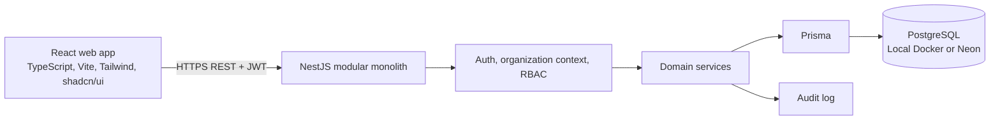

# System Architecture

## Architecture decision

Use a modular monolith: React web application, NestJS REST API, PostgreSQL, and Prisma. It provides clear domain boundaries and straightforward transactions without service-distribution overhead.



## Technology contract

| Layer | Choice | Responsibility |
| --- | --- | --- |
| Web | React, TypeScript, Vite, Tailwind, shadcn/ui, TanStack Query | UX, forms, routing, presentation of server state |
| API | Node.js, NestJS, TypeScript, REST, Zod | Authorization, validation, rules, transactions, calculations |
| Data | PostgreSQL, Prisma, Neon/local Docker | Relational source of truth and integrity constraints |
| Auth | Password hashing, JWT, RBAC | Identity, active tenant, permissions |
| Workspace | pnpm, Turborepo, Docker Compose | Local development and shared tooling |

The API is authoritative for prices, totals, discounts, taxes, subscription transitions, and payment settlement. The browser may preview calculations only.

## Repository shape

```text
apps/api          NestJS API
apps/web          React/Vite app
packages/database Prisma schema, generated client, migrations
packages/config   shared TypeScript/lint/tool configuration
packages/types    narrowly shared transport types only
packages/ui       later, when real shared UI exists
infra/docker      local infrastructure configuration
docs              engineering documentation and ADRs
```

## Tenant isolation boundary

`User` is a global identity. `OrganizationMembership` establishes tenant access. An authenticated request resolves the active organization, verifies membership, resolves organization-scoped permissions, and only then runs tenant-scoped domain queries. Major owned records carry `organization_id`; child records inherit ownership only where their parent link cannot cross tenants. For high-risk links, use tenant-aware composite constraints where practical and always validate parent ownership in the service.

High-risk financial links require defense in depth: subscriptions reference tenant-matching customers/plans; invoices reference tenant-matching customers and, when present, subscriptions; payments reference tenant-matching invoices; refunds reference tenant-matching payments. The database design defines composite `(organization_id, id)` reference patterns for these relationships.

## Domain boundaries

API modules are `auth`, `organizations`, `users`, `roles`, `customers`, `products`, `plans`, `subscriptions`, `quotations`, `invoices`, `payments`, `discounts`, `taxes`, `reports`, and `audit`. Each module holds its controller, request schemas, service/domain logic, focused data access, types, and critical tests. Controllers translate HTTP; services own business behavior.

Cross-domain calls are explicit and local. For example, invoice finalization invokes calculation and audit logic inside one database transaction rather than an internal HTTP request.

## Security and evolution

- JWT identifies the user; an organization selector is an intent signal and membership is the authority.
- Guards/decorators apply authentication, tenant context, and permission checks before handlers.
- Zod validates external data; services enforce ownership, state, and cross-row rules.
- Secrets and password hashes are never returned, committed, or unsafely logged.
- Use database transactions for multi-write business commands.
- Financial commands use an idempotency key from their first release; client retries and double submits are sufficient duplicate-risk sources.
- Tenant-scoped business numbers use a transactional `organization_sequences` counter row, never `MAX`/`COUNT + 1`.
- Select locks or optimistic versions per remaining demonstrated concurrency risk.
- Start reports from PostgreSQL queries. Introduce queues, cache, separate analytics, graph, or AI only after measured need.
