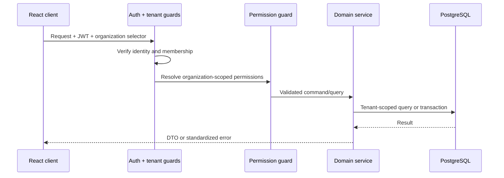

# Low-Level Design

## Request pipeline

Every tenant-record lookup filters by active organization and record ID. The client never gains access merely by supplying an `organizationId`.

## Module pattern

Each domain has a Nest module, controller, service, Zod schemas/DTOs, domain types, and tests where behavior is business-critical. A service can use Prisma directly for straightforward access. Add a repository only if it centralizes nontrivial data access or a genuinely shared concern.

Use command methods for lifecycle work: `confirmSubscription`, `activateSubscription`, `pauseSubscription`, `resumeSubscription`, `cancelSubscription`, `finalizeInvoice`, `voidInvoice`, `recordPayment`, and `createRefund`. Generic status mutation is not exposed.

## State machines

Quotations and subscriptions are independent aggregates. A quotation follows `DRAFT → ISSUED → ACCEPTED | REJECTED | EXPIRED | CANCELLED`. Accepting a quotation can create a subscription and records the resulting `sourceQuotationId`.

Subscriptions use `DRAFT → CONFIRMED → ACTIVE`. Active can become `PAUSED`, `CANCELLED`, `EXPIRED`, or `CLOSED`; Paused can resume to Active or cancel. Each successful command writes an event, writes an amendment if commercial state changed, and writes an audit record.

Invoices use `DRAFT`, `FINALIZED`, `PARTIALLY_PAID`, `PAID`, and `VOID`. `OVERDUE` is initially derived from due date and outstanding balance. Finalized invoice lines/totals cannot change. Payment/refund commands update settlement information within the same transaction.

## Transaction patterns

| Operation | Atomic work |
| --- | --- |
| Create subscription | Validate tenant-owned customer/plan, resolve price, snapshot items, assign number, event/audit |
| Amend subscription | Validate transition, write amendment/event, update current state, audit |
| Finalize invoice | Validate draft, calculate decimals, persist snapshots/totals, finalize, audit |
| Record payment | Claim idempotency key, validate invoice/currency, assign number, persist payment, update derived balance/state, audit |
| Refund | Claim idempotency key, validate refundable amount, assign number, persist refund, update derived settlement projection, audit |

## Calculation and history

A billing calculation component will centralize decimal operations and rounding. It accepts line snapshots and applicable rules and returns line subtotal, discount, tax, line total, and invoice totals. It uses decimal values and explicit currencies; `Math.round` or JS floating point is prohibited for authoritative money. Stored amounts use `NUMERIC(19,4)`; a central currency policy determines display/minor-unit precision and a central rounding policy determines calculation precision, discount/tax order, tax inclusivity, and line-versus-invoice rounding.

Payment/refund rows are financial facts. `amountPaid` and `amountDue`, if stored on an invoice for query performance, are explicitly transactional projections rebuilt from finalized totals, succeeded payments, refunds, and credit notes; they are not independent sources of truth.

`SubscriptionEvent` is a business timeline. `AuditLog` is append-only actor/resource history. Metadata can be limited snapshots, but queryable facts remain relational.

## Code conventions

- Prisma models use PascalCase and map to plural `snake_case` tables.
- API resources use plural nouns; commands use action routes.
- Instants use `TIMESTAMPTZ`; calendar concepts use `DATE`.
- UUIDs identify records; human-facing tenant numbers are separate.
- List endpoints paginate, use allow-listed filters, and have stable ordering.
- Errors use centralized codes, safe messages, and appropriate HTTP statuses.
